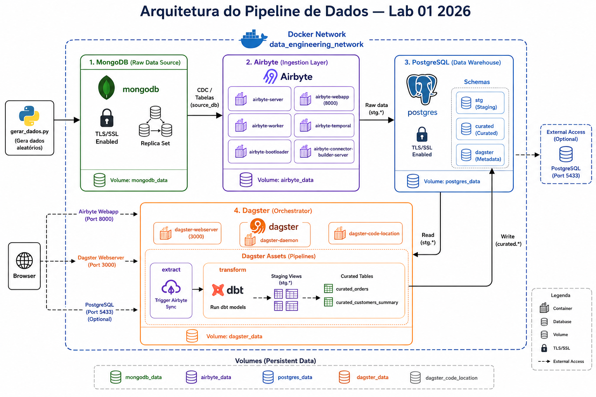

# 🏗️ Lab 01

Stack completa de engenharia de dados rodando localmente com Docker Compose.

## Arquitetura



O ambiente é composto por:
- **MongoDB** (fonte de dados brutos) com TLS e Replica Set.
- **Airbyte** (ingestão) extraindo do MongoDB e carregando no PostgreSQL.
- **PostgreSQL** (data warehouse) com schemas `stg`, `curated` e `dagster`.
- **Dagster** (orquestrador) acionando jobs do Airbyte e rodando transformações dbt.
- **dbt** (transformação) modelando dados de staging para tabelas curadas.
- **Gerador de dados** (Python) para popular o MongoDB com dados de exemplo.

```
MongoDB (source)
    └──[Airbyte Sync]──► PostgreSQL schema: stg
                              └──[dbt build]──► PostgreSQL schema: curated
                                                        ↑
                                              [Dagster orquestra tudo]
```

| Serviço | URL | Credenciais |
|---|---|---|
| **Dagster UI** | http://localhost:3000 | — |
| **Airbyte UI** | http://localhost:8000 | airbyte / password |
| **PostgreSQL** | localhost:5432 | dw_user / dw_password123 |
| **MongoDB** | localhost:27017 | mongo_user / mongo_password123 |

## Pré-requisitos

- Docker Desktop >= 24.x
- Docker Compose >= 2.x
- **RAM recomendada: 12GB+** (Airbyte consome ~4-6GB)

---

## 🚀 Subindo a Stack

### 1. Iniciar todos os serviços

```bash
# Clonar/entrar no diretório
cd lab-01-2026
```

### 1.2 Iniciar os Serviços

Como o MongoDB do Airbyte exige configurações de segurança avançadas (TLS), criamos scripts que automatizam a geração de certificados e aplicação de patch no conector antes de subir os serviços.

**Se estiver no Windows (PowerShell):**
```powershell
.\setup.ps1
```

**Se estiver no Linux/macOS:**
```bash
chmod +x setup.sh
./setup.sh
```

### 1.3 Acompanhar logs

```bash
docker compose logs -f
```

### 2. Verificar se está tudo saudável

```bash
docker compose ps
```

Aguardar todos os serviços com status `healthy` ou `running`.

---

## ⚙️ Configurando o Airbyte (único passo manual)

O Airbyte precisa ser configurado via UI para criar a connection MongoDB → PostgreSQL.

### 2.1 Acessar o Airbyte UI

Abrir http://localhost:8000 (usuário: `airbyte`, senha: `password`)

### 2.2 Criar o Source (MongoDB)

1. Ir em **Sources** → **New source**
2. Buscar por **MongoDB V2**
3. Preencher:
   - **Cluster Type:** Selecione `Self-Managed Replica Set`
   - **Connection String:** `mongodb://mongodb:27017/` (Sem credenciais aqui)
     > ⚠️ O conector *MongoDB V2* exige TLS. O ambiente foi modificado com um certificado autoassinado (injetado na JVM do conector e no MongoDB) para suportar isso de forma transparente.
   - **Database Name:** `source_db`
   - **Username:** `mongo_user`
   - **Password:** `mongo_password123`
   - **Authentication Source:** `admin`
4. Clicar em **Test and save**

### 2.3 Criar o Destination (PostgreSQL)

1. Ir em **Destinations** → **New destination**
2. Buscar por **Postgres**
3. Preencher:
   - **Destination name:** `PostgreSQL DW`
   - **Host:** `postgres`  ← (nome do container na rede Docker)
   - **Port:** `5432`
   - **DB Name:** `datawarehouse`
   - **Schema:** `stg`
   - **Username:** `dw_user`
   - **Password:** `dw_password123`
4. Clicar em **Test and save**

### 2.4 Criar a Connection

1. Ir em **Connections** → **New connection**
2. Selecionar o source **MongoDB Local**
3. Selecionar o destination **PostgreSQL DW**
4. Selecionar as streams: `orders` e `customers`
5. Modo de sync: **Full refresh | Overwrite**
6. Salvar a connection

### 2.5 Copiar o Connection ID

Após salvar, a URL da connection será algo como:
```
http://localhost:8000/connections/xxxxxxxx-xxxx-xxxx-xxxx-xxxxxxxxxxxx
```

Copiar o UUID e atualizar o `.env`:
```env
AIRBYTE_CONNECTION_ID=xxxxxxxx-xxxx-xxxx-xxxx-xxxxxxxxxxxx
```

> **Nota:** Reiniciar o container `dagster-code` após atualizar o `.env`:
> ```bash
> docker compose restart dagster-code dagster-webserver dagster-daemon
> ```

---

## 🎯 Rodando o Pipeline no Dagster

1. Abrir http://localhost:3000
2. Ir em **Assets** — você verá o grafo completo:
   ```
   mongodb_to_postgres_stg → stg_orders → curated_orders
                           → stg_customers → curated_customers_summary
   ```
3. Clicar em **Materialize all** para rodar o pipeline completo
4. Acompanhar o status em **Runs**

### Rodando via CLI

```bash
# Pipeline completo
docker exec dagster-webserver dagster job execute \
  -f /opt/dagster/app/pipelines/definitions.py \
  -j pipeline_completo

# Apenas extração
docker exec dagster-webserver dagster job execute \
  -f /opt/dagster/app/pipelines/definitions.py \
  -j job_extracao

# Apenas transformação dbt
docker exec dagster-webserver dagster job execute \
  -f /opt/dagster/app/pipelines/definitions.py \
  -j job_transformacao
```

---

## 🔍 Validando os Dados

```bash
# Verificar dados na camada staging
docker exec -it postgres psql -U dw_user -d datawarehouse \
  -c "SELECT order_id, customer_name, order_status, total_amount FROM stg.stg_orders LIMIT 5;"

# Verificar dados na camada curated
docker exec -it postgres psql -U dw_user -d datawarehouse \
  -c "SELECT order_id, customer_name, ticket_categoria, is_vip_order FROM curated.curated_orders;"

# Verificar sumário de clientes
docker exec -it postgres psql -U dw_user -d datawarehouse \
  -c "SELECT customer_name, total_orders, lifetime_value, rfm_segment FROM curated.curated_customers_summary;"
```

---

## 🛑 Parando a Stack

```bash
# Parar sem remover volumes (preserva dados)
docker compose stop

# Parar e remover containers (preserva volumes)
docker compose down

# Parar e remover TUDO incluindo volumes (reset completo)
docker compose down -v
```

---
## 📁 Estrutura do Projeto

```
lab-01-2026/
├── .env                         # Variáveis de ambiente (não versionado)
├── Makefile                     # Comandos utilitários
├── docker-compose.yml           # Orquestração dos serviços
├── setup.ps1                    # Script de configuração inicial (PowerShell)
├── Dockerfile.mongo-connector   # Patch do conector Airbyte para MongoDB
├── README.md
│
├── airbyte/
│   └── temporal/
│       └── development.yaml     # Configuração do Temporal (Airbyte)
│
├── app/                         # Gerador de dados aleatórios
│   ├── gerar_dados.py           # Script principal
│   └── requirements.txt         # Dependências (pymongo, faker)
│
├── certs/                       # Certificados TLS (gerados automaticamente)
│   ├── mongodb.key
│   ├── mongodb.crt
│   ├── mongodb.pem
│   └── mongo-keyfile
│
├── dagster/
│   ├── Dockerfile
│   ├── requirements.txt
│   ├── dagster.yaml
│   ├── workspace.yaml
│   └── pipelines/
│       ├── definitions.py       # Ponto de entrada do Dagster
│       └── assets/
│           ├── extract.py       # Asset de extração (Airbyte)
│           └── transform.py     # Assets de transformação (dbt)
│
├── dbt/
│   ├── dbt_project.yml
│   ├── profiles.yml
│   ├── packages.yml
│   ├── models/
│   │   ├── staging/
│   │   │   ├── stg_orders.sql
│   │   │   ├── stg_customers.sql
│   │   │   └── schema.yml
│   │   └── curated/
│   │       ├── curated_orders.sql
│   │       ├── curated_customers_summary.sql
│   │       └── schema.yml
│   │
│   ├── dbt_packages/            # Dependências instaladas (ignorar)
│   ├── logs/                    # Logs de execução (ignorar)
│   └── target/                  # Artefatos compilados (ignorar)
│
├── mongo-init/
│   └── init.js                  # Seed inicial do MongoDB
│
└── postgres-init/
    └── init.sql                 # Criação dos schemas no PostgreSQL
```

> **Notas:**
> - A pasta `certs/` é criada automaticamente na primeira execução do `setup.ps1` (certificados autoassinados).
> - Os diretórios `dbt/dbt_packages`, `dbt/logs` e `dbt/target` são gerados pelo dbt e não precisam estar versionados no git.
> - O arquivo `.env` contém credenciais e configurações.
```

Essa estrutura inclui os novos arquivos (`setup.ps1`, `Dockerfile.mongo-connector`, `app/`) e mantém a organização original, com destaque para as pastas de artefatos gerados.
